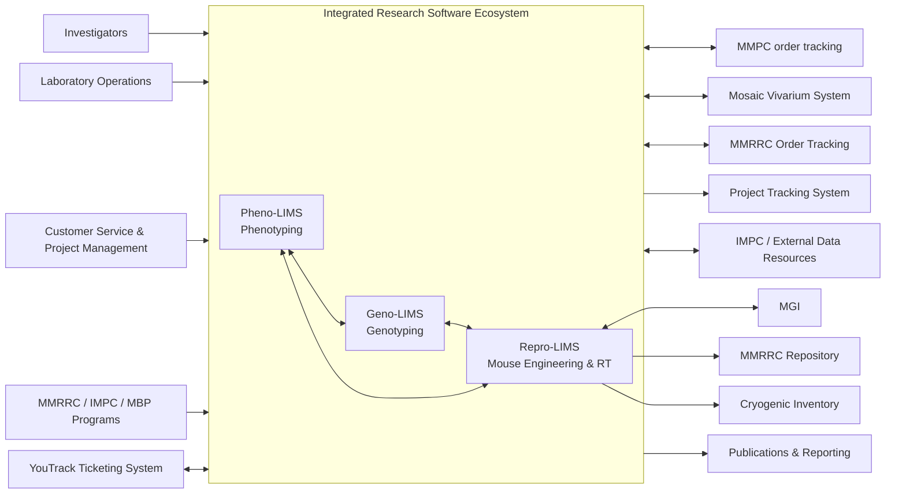

# MBP Software Ecosystem

[View the ecosystem diagram source](ecosystem-docs/diagrams/ecosystem.mmd).

Repro-LIMS is the Mouse Biology Program laboratory information management system for high-throughput mouse engineering and reproductive technology operations. It coordinates the logistics, records, production metrics, cryogenic inventory, recovery workflows, and delivery of engineered mouse models, including KOMP/IMPC production, MMRRC order fulfillment, academic requests, and related project status reporting.

Geno-LIMS is the in-house genotyping laboratory information management system for the Murine Genetic Engineering Laboratory. It tracks mouse tissue samples from cage-side collection through rack submission, DNA extraction, PCR setup, primer management, gel analysis support, and reporting, preserving chain of custody and work-in-progress status for high-throughput mouse genotyping.

Pheno-LIMS is the Mouse Biology Program phenotyping laboratory information management system. It schedules, tracks, collects, validates, stores, visualizes, and submits mouse phenotyping data, supporting technician bench workflows, instrument file parsing, validation feedback, QC review, reporting, and IMPC/DCC data submission for KOMP and other phenotyping projects.

Together, these systems describe the lifecycle of engineered mice across the MBP ecosystem. Mice produced in Repro-LIMS are validated through Geno-LIMS and then move on to characterization workflows in Pheno-LIMS. Mice can also enter each system as standalone projects depending on investigator needs. While the LIMS applications are built to support large high-throughput projects, they remain flexible enough for ad hoc and project-specific work. Mice produced as part of the KOMP project are also added to the MMRRC catalog, and phenotyping data generated from these mice are uploaded to IMPC / external data resources for downstream discovery and reporting.

