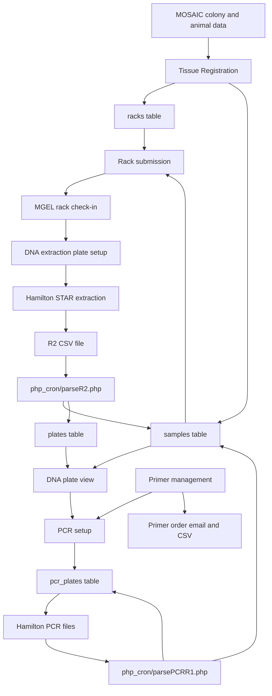
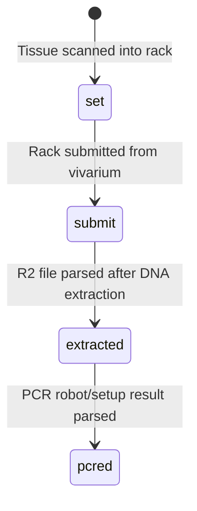

# MGEL-LIMS (Geno -LIMS)

MGEL-LIMS is the in-house genotyping laboratory information management system for the UC Davis Mouse Biology Program Murine Genetic Engineering Laboratory. The application tracks mouse tissue samples from cage-side sampling through rack submission, DNA extraction, PCR setup, primer management, gel analysis support, and reporting.

The system has been in continuous production use since 2012. It is a process-driven PHP/MySQL application that has evolved with MGEL workflow changes, robotics file formats, scanner hardware, MOSAIC colony-management integration, and primer ordering requirements.

## Purpose

MGEL-LIMS provides chain-of-custody and work-in-progress tracking for high-throughput mouse genotyping:

- Register tissue samples collected from mice in MOSAIC-managed colonies.
- Assign collected samples to physical 96-well racks and tube barcodes.
- Submit nearly full racks from the vivarium to MGEL.
- Check racks into MGEL and combine racks into DNA extraction plates.
- Consume Hamilton STAR robot output files after DNA extraction.
- Present extracted DNA plates for PCR setup and downstream QC.
- Manage PCR primers, primer pairs, expected band sizes, and primer reorder status.
- Generate PCR plate setup files and consume robot result/setup files.
- Support reports for sample status, PCR master logs, resampling, and pipeline progress.

## Primary Workflow



## Application Areas

| Area | Path | Role |
| --- | --- | --- |
| Login/session handling | `html/verify.php` | Authenticates against the KOMP login tables and records access attempts in `mgal.access_log`. |
| Shared configuration | `html/includes/` | Loads `.env`, creates PDO connections, wraps MOSAIC API calls, renders shared layout and navigation. |
| Tissue registration | `html/tissue/` | Cage-side sampling workflow. Pulls colony and animal data from MOSAIC, assigns animals to scanned tubes/rack wells, and writes `samples` and `racks`. |
| Rack check-in | `html/mgal_checkin/` | MGEL receiving and rack/sample review tools. Shows rack maps, sample grids, searches, and status changes. |
| DNA extraction | `html/dna_extraction/` | Lists extracted DNA plates from `plates` and `samples`, with links to DNA plate maps. |
| PCR workflow | `html/PCR/` | DNA plate view, PCR setup, primer grids, primer pairs, primer ordering, add-sample tools, PCR group editing, and status views. |
| PCR plate/project tools | `html/pcr_project/` | PCR plate creation, recall, exports, Hamilton-oriented formats, and 384-well file generation. |
| PCR check-in | `html/PCR_checkin/` | Check-in workflow for PCR plates. |
| Reports | `html/reports/` | PCR master log, resampling events, and sample pipeline chart. |
| Admin/manage | `html/manage/` | Pathway settings and related management functions. |
| Scheduled processing | `php_cron/` | Robot file parsers, MOSAIC/LabTracks/KOMP synchronization helpers, primer matching, primer order emails, and reports. |

## Integrations

| System | Direction | Implementation | Notes |
| --- | --- | --- | --- |
| MOSAIC Vivarium | Read | `html/includes/lib.php`, `html/tissue/m_ajax_functions.php`, `html/PCR/get_mosaic.php` | Used for colony lists, animal records, GUIDs, cage/account context, and live links back to MOSAIC. |
| Hamilton STAR | File input/output | `php_cron/parseR2.php`, `php_cron/parsePCRR1.php`, `html/pcr_project/` | R2 files update extracted DNA locations. PCR R1 files update PCR plate/sample status. |
| Scanner files | Input | `html/tissue/` | Sample scanner output is loaded during rack sampling to associate physical tube barcodes with rack wells. |
| KOMP database | Read | `html/verify.php`, PCR display helpers, cron sync scripts | Used for login, gene/mutation metadata, KOMP line details, and some legacy reporting. |
| LabTracks mirror / MBP database | Read | `php_cron/genoSync.php`, PCR helpers | Used for parent/strain/genotype fields and historical LabTracks animal metadata. |
| Email / SMTP | Output | `php_cron/order_primers.php`, `php_cron/cron_utils.php`, report scripts | Sends primer order lists, reports, and workflow notifications. |
| IDT | Email/CSV order output | `php_cron/order_primers.php` | Primers with `status = 'order'` are emailed as an order list and then marked `ordered`. |

## Core Data Model

### Main `mgal` Tables

| Table | Role | Key relationships / fields used by code |
| --- | --- | --- |
| `samples` | Central sample lifecycle table. One row represents a collected mouse sample/tube and accumulates status, animal metadata, rack position, DNA plate position, PCR status, flags, and grouping data. | Joins to `racks` by `tube_id`; joins to `plates` by `tube_id`, `plate_id`, and `plate_well`; updated by tissue registration, `parseR2.php`, `parsePCRR1.php`, and sync scripts. Important fields include `sample_id`, `tube_id`, `sample_status`, `rack_id`, `rack_uid`, `plate_id`, `plate_well`, `grp_plate_id`, `lt_id`, `mo_guid`, `mo_colony_guid`, `stock_num`, `pedigree`, `grouping_id`. |
| `racks` | Physical 96-well rack/tube location table. | Written during tissue registration. Uses `rack_id`, `rack_uid`, `rack_batch_id`, `tube_id`, `tube_status`, `tube_well`, `tube_coll`, `user`, `timestamp`. |
| `plates` | DNA extraction plate output from Hamilton STAR R2 files. | Inserted by `parseR2.php`. Links `plate_id`, `rack_id`, `rack_bc`, `tube_id`, `plate_well`, `sample_id`, `lt_id`, `datetime`. |
| `robot_files` | Idempotency ledger for robot CSV files already processed. | `parseR2.php` and `parsePCRR1.php` check and insert file paths here before/after processing. |
| `pcr_plates` | PCR setup and final PCR plate tracking. | Updated by PCR setup pages and `parsePCRR1.php`. Tracks DNA plate/well, PCR setup ID, PCR plate/well, primer/master mix locations, status, controls, and robot output state. |
| `primers` | Primer inventory and ordering table. | Used by primer grids, primer detail forms, primer order forms, `order_primers.php`, and `primer_2_sample.php`. Status values include `new`, `order`, and `ordered`. |
| `grouping` | Genotyping group metadata. | Used heavily in PCR selection and primer matching. Links groups to pathway, band-size, mutation, and primer metadata. |
| `grouping_primers` | Derived mapping between groupings and likely matching primers. | Rebuilt by `php_cron/primer_2_sample.php`. |
| `band_size` | Primer pair/band-size metadata. | Used by PCR detail display to show expected bands. |
| `pathway` | Genotyping pathway/testing metadata. | Managed under `html/manage/`; joined by PCR detail views. |
| `pcr_log` | PCR logging/master-log support. | Used in PCR/report grids. |
| `pipeline_history` | Pipeline reporting history. | Used by reporting and chart views. |
| `access_log` | Login attempt audit table. | Written by `html/verify.php`. |
| `384_order` | 384-well PCR ordering/support table. | Used by `html/pcr_project/384_*` tools. |

### External Databases

| Database | Tables referenced | Role |
| --- | --- | --- |
| `komp` | `login`, `user`, `KOMPclone`, `K312`, `clone`, `vial`, `genes`, `qc_microinjection`, `mutation`, and related metadata tables | Authentication plus gene, mutation, project, clone, vial, and KOMP line metadata. |
| `mbp` | `labtracks_animal_mirror` | LabTracks mirror data for animal lineage, strain, genotype, mutations, and parent records. |
| `mbplims` | Configured in `.env.sample` | Available connection for MBP LIMS data; usage should be confirmed against current code and production configuration. |

## Sample Status Flow

The application uses status fields on `samples`, `racks`, and PCR tables to represent physical state and work state.



Important implementation points:

- Tissue registration writes `samples.sample_status = 'set'` and `racks.tube_status = 'set'`.
- Submitting a rack updates both `samples.sample_status` and `racks.tube_status` to `submit`.
- `php_cron/parseR2.php` updates matching `samples` rows to `extracted`, fills `plate_id`, `plate_well`, and `grp_plate_id`, and inserts matching `plates` rows.
- `php_cron/parsePCRR1.php` updates matching DNA plate wells to `pcred` and updates `pcr_plates`.

## Robot File Processing

### DNA Extraction R2 Files

`php_cron/parseR2.php` scans `/mgal_lims/File_Sharing/*R2.csv` for files modified within the last three days. For each unprocessed file:

1. Read CSV rows with `Tube_BC`, `Plate_BC`, `Rack_BC`, and `DNA_DST`.
2. Skip rows where the tube was already assigned to a DNA plate.
3. Skip rows where the tube is not present in `samples`.
4. Update the matching `samples` row to `sample_status = 'extracted'`.
5. Insert one row into `plates`.
6. Insert the file path into `robot_files` to prevent reprocessing.

Useful log signals:

- `DUP_WARN`: tube was already extracted.
- `DNE_WARN`: tube barcode was not found in `samples`.
- `MULTI_WARN`: duplicate tube rows exist in `samples`.
- `EMPTY_FILE`: file was present but had no parsed rows.
- `No New Robot Files`: no recent files were found on the shared drive.
- `EXCEPTION`: parser-level failure.

### PCR R1 Files

`php_cron/parsePCRR1.php` scans `/mgal_lims/File_Sharing/PCR*R1.csv` for unprocessed robot files. For each row, it updates `pcr_plates` and, for non-control DNA wells, updates `samples.sample_status` to `pcred`.

Control wells such as `NTC`, `WT`, and `POS` are handled as PCR plate rows without updating a sample row.

## Scheduled Jobs

The production crontab is represented in `crontab_php`.

| Schedule | Script | Purpose |
| --- | --- | --- |
| Every 30 minutes | `php_cron/genoSync.php` | Updates recent sample rows with LabTracks mirror genotype, parent, strain, group, and stock information. |
| Daily 20:50 | `php_cron/primer_2_sample.php` | Rebuilds `grouping_primers` by matching group names to primer names. |
| Daily 10:35 and 19:35 | `php_cron/groups_consolidated.php` | Consolidates or refreshes group-related data. |
| Daily 15:00 | `php_cron/order_primers.php` | Emails primer order CSV/list for `primers.status = 'order'` and marks those primers `ordered`. |
| Disabled | `php_cron/pipeline_report.php` | Pipeline report disabled per MGEL-116 comment in crontab. |

To update the active crontab on the server, edit `crontab_php`, commit/push it, then update the server crontab:

```bash
sudo crontab -e
sudo crontab -l
```

## Configuration

Runtime configuration is loaded from `.env` by `html/includes/config.php`. A template is provided in `.env.sample`.

Required configuration categories:

- Environment name and non-production test email recipient.
- MySQL connections for `mgal`, `mbp`, `komp`, and `mbplims`.
- MOSAIC API base URL and credentials.
- SMTP host, port, sender, reply-to, and report recipients.
- Primer order recipient/CC lists.
- MGEL sample submission recipient/CC lists.

Composer installs dependencies into `html/vendor`:

- `vlucas/phpdotenv` v2 for PHP 5 compatibility.
- PHPMailer.
- Bootstrap 5 and FontAwesome assets.
- PHP extensions: curl, json, openssl, PDO.

## Local / Deployment Notes

- Web root is `html/`.
- Shared writable paths noted in production operations:
    - `logs/jqGrid.log`
    - `html/cache/colonies.json`
- The application expects HTTPS for secure session cookies.
- Robot file parsing expects access to `/mgal_lims/File_Sharing`.
- Logs are commonly written under `/var/log/mgal/`.
- The codebase includes legacy jqGrid assets and legacy PHP patterns. Modernization notes are in `README-refactor-notes.md`.
- After upgrading beyond PHP 5.5, review PHPMailer upgrade notes and the mail call sites in `php_cron/cron_utils.php`, `php_cron/pipeline_report.php`, and `html/pcr_project/pcr_plate_functions.php`.

## Legacy And Planned Functionality

The application contains older modules, appendix-style files, and planned functionality that may not represent the current production path. For review, classify each module as one of:

- Active production workflow.
- Active support/reporting tool.
- Scheduled background job.
- Manual recovery or administrative tool.
- Historical/planned appendix.
- Retired or unknown.

The navigation in `html/includes/nav.php` is the best starting point for active user-facing functionality, but it is not a complete inventory of cron jobs, robot parsers, or manual support scripts.

## Operations

### Debugging `parseR2.php`

```bash
cat /var/log/mgal/parseR2_php.log | grep "Updates"
zcat /var/log/mgal/parseR2_php.log.2.gz | grep "Updates"
```

Sample output:

```text
2022-08-18 08:30:13: Processed: /mgal_lims/File_Sharing/D_2022_08_17_1519_R2.csv Updates: 189  Inserts: 166  Actual: 166  Skipped: 0
2022-08-19 07:30:02: Processed: /mgal_lims/File_Sharing/D_2022_08_18_1539_R2.csv Updates: 44  Inserts: 44  Actual: 44  Skipped: 0
```

For a clean parse, inserts should match the expected number of actual robot rows, with skipped rows explained by warnings.

### Cleanup Wild Characters

To find non-ASCII characters across string columns in the `mgal` database, generate consolidated SQL from `information_schema` and run it table by table.

Example single-column check:

```sql
SELECT sequence, CONVERT(sequence USING ASCII)
FROM mgal.primers
WHERE CONVERT(sequence USING ASCII) IS NULL;
```

Consolidated query generator:

```sql
SET SESSION group_concat_max_len = 100000;
SELECT
  col.table_name,
  GROUP_CONCAT(
   CONCAT('SELECT "',col.table_schema,'.',col.table_name,'.',col.column_name,'" as col,',col.column_name,', CONVERT(',col.column_name,' USING ASCII) FROM ',col.table_schema,'.',col.table_name,' WHERE ',col.column_name,' <> CONVERT(',col.column_name,' USING ASCII)') SEPARATOR ' UNION ') as generated_query
FROM information_schema.columns col
JOIN information_schema.tables tab
  ON tab.table_schema = col.table_schema
  AND tab.table_name = col.table_name
  AND tab.table_type = 'BASE TABLE'
WHERE col.data_type in ('char', 'varchar','text', 'tinytext', 'mediumtext','longtext','enum', 'set')
  AND col.table_schema NOT IN ('information_schema', 'sys', 'performance_schema', 'mysql')
  AND col.table_schema = 'mgal'
GROUP BY col.table_name;
```

Previously observed character artifacts include:

```text
Â
ÂÂ
�
Â
Â
Â
‐
’
α
μ
```