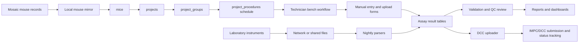
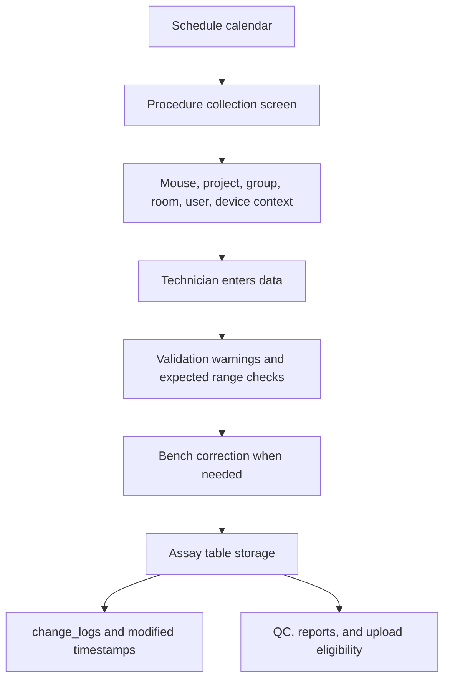
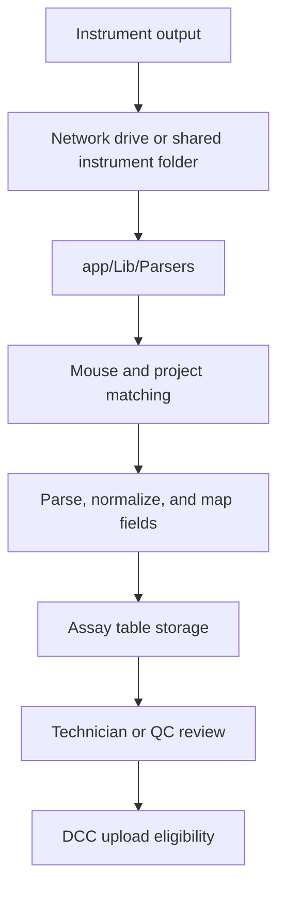
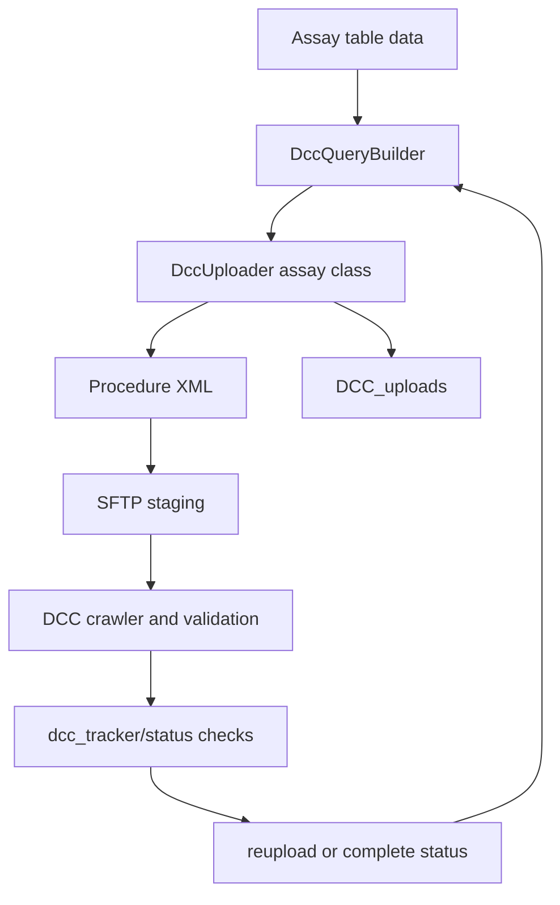
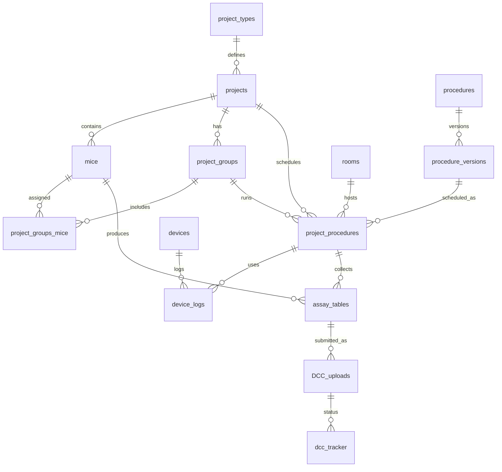

# Pheno-LIMS

## Table of Contents

* [Overview](#overview)
* [Production Scope](#production-scope)
* [Application URLs and Related Resources](#application-urls-and-related-resources)
* [Core Capabilities](#core-capabilities)
* [Scientific and Laboratory Context](#scientific-and-laboratory-context)
* [Pipelines](#pipelines)
* [Primary User Workflows](#primary-user-workflows)
    * [Technician Schedule Workflow](#technician-schedule-workflow)
    * [Cohort and Pipeline Workflow](#cohort-and-pipeline-workflow)
    * [Data Submission Workflow](#data-submission-workflow)
* [Screenshots](#screenshots)
* [Architecture](#architecture)
* [Data Flow](#data-flow)
    * [High-Level Laboratory Data Flow](#high-level-laboratory-data-flow)
    * [Manual Data Collection Flow](#manual-data-collection-flow)
    * [Instrument Parser Flow](#instrument-parser-flow)
    * [IMPC/DCC Upload Flow](#impcdcc-upload-flow)
* [Live Production Schema Overview](#live-production-schema-overview)
    * [Core Entity Relationship](#core-entity-relationship)
* [Data Validation and Provenance](#data-validation-and-provenance)
* [Security, Access, and Backups](#security-access-and-backups)
* [Technical Stack](#technical-stack)
* [Operational Dashboards](#operational-dashboards)
* [Setup](#setup)
* [Technical Appendix](#technical-appendix)
* [ACLs](#acls)
* [Definition of Terms](#definition-of-terms)
* [MySQL Tables and Descriptions](#mysql-tables-and-descriptions)
    * [Specimens](#specimens)
    * [Projects and Procedures](#projects-and-procedures)
    * [IMPC Uploads](#impc-uploads)
    * [Metadata](#metadata)
    * [Assay Data](#assay-data)
* [Data Collection](#data-collection)
    * [Mouse Data from Mosaic](#mouse-data-from-mosaic)
    * [Assay Parsers](#assay-parsers)
    * [Web Forms](#web-forms)
* [DCC Uploads](#dcc-uploads)
    * [DCC_uploads Table](#dcc_uploads-table)
    * [DCC_uploads Status](#dcc_uploads-status)
    * [Marking for Reupload](#marking-for-reupload)
* [Troubleshooting](#troubleshooting)
* [Adding a New Procedure](#adding-a-new-procedure)
    * [App Files](#app-files)
    * [Database Updates](#database-updates)
    * [Create a Parser](#create-a-parser)
    * [Create a Form](#create-a-form)
* [Adding a New Pipeline](#adding-a-new-pipeline)
* [Moving Mice Between Projects](#moving-mice-between-projects)
* [Data Lifecycle](#data-lifecycle)
    * [Non-KOMP Projects](#non-komp-projects)
    * [KOMP Projects](#komp-projects)

## Overview

Pheno-LIMS is the Mouse Biology Program phenotyping laboratory information management system. It is an internal web application used to schedule, track, collect, validate, store, visualize, and submit mouse phenotyping data. The application has been in continuous production use for 13 years and supports the daily work of a high-throughput phenotyping laboratory while remaining flexible enough for smaller ad hoc and private projects.

The system was originally built in 2013 on CakePHP 2.4 (Currently frozen at 2.9) and has been maintained through many process changes, procedure additions, and data submission requirement changes. Its central purpose is to reduce the burden of laboratory data capture while preserving procedure scheduling, mouse identity, cohort context, equipment context, validation feedback, and downstream submission readiness.

Pheno-LIMS supports the Knockout Mice Program and International Mouse Phenotyping Consortium data flow by collecting procedure data according to IMPReSS-aligned expectations, parsing instrument outputs, validating captured values, and preparing uploads for the IMPC/DCC submission pipeline.

## Production Scope

Pheno-LIMS has supported:

* 13 years of continuous production use.
* 45,268 tracked mice.
* More than 960,913 cohort-level procedure records collected.
* More than 32 phenotyping procedures.
* 16 workflow definitions, referred to in the application as pipelines.
* Pipeline cohorts that commonly average from 5 to 12 mice.
* Individual mice undergoing as many as 32 procedures.
* High-throughput KOMP/KOMP2 phenotyping and private/ad hoc phenotyping projects.

## Application URLs and Related Resources

* Production URL: https://lims.mousebiology.org
* Database: `mbplims`
* Production path: `/u01/www/vhosts/lims.mousebiology.org/html`
* Repository: https://git.mousebiology.org/ucd-mbp/lims.mousebiology.org.git
* IMPReSS: https://www.mousephenotype.org/impress/index
* UCD specific IMPC assays: https://www.mousephenotype.org/impress/procedures/13
* UCDIP specific IMPC assays: https://www.mousephenotype.org/impress/PipelineInfo?id=46
* UCDLA specific IMPC assays: https://www.mousephenotype.org/impress/PipelineInfo?id=32

## Core Capabilities

Pheno-LIMS provides the operational backbone for the phenotyping lab:

* Mouse, embryo, colony, project, cohort, and pipeline tracking.
* Project and cohort management for KOMP, KOMP2, KOMP2 Phase 3, variant, private, and ad hoc projects.
* Procedure scheduling through the lab calendar.
* Technician-oriented procedure setup and data collection screens.
* Manual data entry for bench procedures.
* Browser-based upload and parsing of instrument output files.
* Nightly parsing of files saved by instruments to shared network locations.
* Equipment, room, device, and environmental context tracking.
* Timed procedure support, including interfaces that replicate benchtop timer workflows.
* Visual color coding for procedures, equipment, instrumentation, and associated mice.
* Validation warnings after data collection.
* Data review and QC workflows.
* XML generation and submission tracking for IMPC/DCC uploads.
* Dashboards, reports, and TV schedule display.

## Scientific and Laboratory Context

The application was designed around the phenotyping technician workflow. The schedule calendar is the primary point of contact for technicians. A technician can filter the calendar to their assigned workload, select a scheduled procedure, set up the procedure, capture data, review validation warnings, and store the completed data.

The data collection model assumes that bad data should be corrected at the bench whenever possible. Technicians are presented with collected values and validation warnings immediately after procedure completion so that data entry errors, unexpected values, instrument issues, or procedure problems can be corrected while the animal, equipment, and source context are still available.

Pheno-LIMS supports high-throughput phenotyping while still allowing project-specific workflows. KOMP-oriented workflows automate recurring scheduling and submission requirements. Private and ad hoc projects can be configured manually with project-specific procedures, cohorts, equipment, and collection methods.

## Pipelines

Pipelines are reusable workflow definitions that define which procedures are automatically scheduled for a project or cohort. The major active pipeline families follow major projects:

* KOMP early adult pipeline.
* KOMP2 late adult pipeline.
* Variant pipeline.
* KOMP2  early adult pipeline.
* KOMP2 Phase 3 pipeline.
* Private project pipelines.

The pain pipeline, Haplo pipeline, and embryo-only pipeline are retained for historical compatibility but are not currently used.

## Primary User Workflows

### Technician Schedule Workflow

1. Technician opens the schedule calendar.
2. Calendar is filtered by procedure, technician, room, device, or workload.
3. Technician selects a scheduled procedure.
4. Pheno-LIMS opens the relevant procedure setup and collection workflow.
5. Technician confirms the mice, cohort, equipment, room, and timing context.
6. Data is entered manually, uploaded from an instrument file, or received later through a parser.
7. Pheno-LIMS displays collected data and validation warnings.
8. Technician corrects bench-correctable data before final storage.
9. Stored data becomes available for QC, reporting, visualization, and submission workflows.

### Cohort and Pipeline Workflow

1. Mice are available from Mosaic or the local mouse mirror.
2. Users create or import a project.
3. Mice are assigned to project groups.
4. A pipeline or set of procedures is applied.
5. Procedure versions define timing, batch size, duration, staffing, room, and required sample counts.
6. Project procedures are scheduled on the calendar.
7. Procedure data is collected and attached to the project, group, procedure, and mouse context.

### Data Submission Workflow

1. Procedure data is stored in the relevant assay table.
2. DCC upload classes query eligible records.
3. Pheno-LIMS generates procedure-specific XML.
4. XML files are staged for pickup by the DCC.
5. Upload attempts are logged.
6. DCC validation status is checked by scheduled jobs.
7. Failed, edited, or manually flagged data can be marked for reupload.

## Screenshots
* `/schedule-calendar.png` - schedule calendar with workload filtering and procedure color coding.
* `/colony-view.png` - colony view showing colony-level context and phenotyping status.


## Architecture

Pheno-LIMS is a CakePHP 2 application with conventional Cake controllers, models, and views for most web workflows. Several custom modules exist where the framework was too restrictive for parser workflows, IMPC/DCC upload generation, batch operations, and procedure-specific laboratory behavior.

Important application areas:

* `app/Controller` - web controllers for procedures, projects, schedules, uploads, reports, devices, rooms, users, and QC views.
* `app/Model` - Cake models for core entities, assay tables, upload tracking, devices, rooms, colonies, users, and reports.
* `app/View` - Cake views for application screens and shared procedure interfaces.
* `app/Lib/Parsers` - instrument and file parsers used by nightly jobs and import workflows.
* `app/Lib/DccUploader` - IMPC/DCC XML generation, upload status handling, status code uploads, and DCC API support.
* `app/Lib/Mosaic` - integration support for Mosaic mouse data.
* `app/Config` - Cake configuration, ACL configuration, schema snapshots, routes, and environment defaults.
* `app/webroot/bin/scripts` - maintenance, repair, migration, and one-off operational scripts.

## Data Flow

### High-Level Laboratory Data Flow



### Manual Data Collection Flow



### Instrument Parser Flow



### IMPC/DCC Upload Flow



## Live Production Schema Overview

The production database is `mbplims`. The checked-in `app/Config/Schema/schema.sql` file is useful as a codebase reference, but this README describes the live production schema conceptually because production has evolved over years of procedure and workflow changes.

The schema is organized around these domains:

* Specimens and colonies: `mice`, `embryos`, `embryo_moms`, `colonies`, and related status/observation tables.
* Projects and cohorts: `projects`, `project_types`, `project_groups`, `project_groups_mice`, `project_states`, and `project_group_logs`.
* Procedures and scheduling: `procedures`, `procedure_versions`, `procedure_version_types`, `procedure_schedules`, `procedure_users`, `project_procedures`, and `project_procedure_states`.
* Assay data: procedure-specific tables such as `abrs`, `cbcs`, `csds`, `clams`, `dexas`, `ecgs`, `grips`, `gross_pathologies`, `hemas`, `histopathologies`, `ipgtts`, `insulins`, `laczs`, `microcts`, `open_fields`, `startles`, `tissue_weights`, `xrays`, and others.
* Equipment and rooms: `devices`, `device_logs`, `device_states`, `device_types`, `rooms`, `room_logs`, `room_readings`, and `room_states`.
* IMPReSS and IMPC mapping: `impc_parameters`, `impc_pipelines`, `impc_procedures`, and procedure version metadata.
* DCC upload tracking: `DCC_uploads`, `dcc_tracker`, `dcc_specimens`, status code support tables, and uploader-specific metadata.
* Audit and metadata: `change_logs`, comments, attachments, user records, and application logs.

### Core Entity Relationship



`assay_tables` represents the family of procedure-specific result tables. Most assay records carry enough context to associate data with a mouse, project, project procedure, technician/user, device, date/time, QC status, and comments.

## Data Validation and Provenance

Pheno-LIMS is designed to keep validation close to the point of data capture. Procedure screens and upload workflows can show validation warnings when values are outside expected parameters or when required contextual fields are missing. This is important because many errors can only be responsibly corrected while the technician is still at the bench and can inspect the animal, instrument, source file, or procedure notes.

The application records changes through CakePHP application logic, primarily in `AppModel` behavior and the `change_logs` table. Deleted or edited records can be retained for audit and recovery purposes. DCC upload records also preserve submission state so that already-submitted data is not duplicated unless it is deliberately marked for reupload.

## Security, Access, and Backups

Pheno-LIMS is an internal application available only to authenticated users behind the institutional firewall. Access control is managed through the application authentication and ACL system.

Production data is protected by local and offsite backup routines:

* Daily snapshots.
* Weekly snapshots.
* Quarterly snapshots.
* Local backups.
* Offsite backups in AWS.

## Technical Stack

* CakePHP 2.9.
* PHP 5.3.2+ originally; currently PHP 7.2 compatible.
* MySQL 5.1.41+.
* Apache 2.2.20+ with `mod_rewrite`.
* Composer.
* ImageMagick.
* `dcmtk`, including `dcm2pnm`, for Xray DICOM to PNG conversion.
* PHP-APC historically, with file cache fallback available in `Config/bootstrap.php`.
* `app/Vendor/DataSource2.php` for CSV parsing in upload workflows.

## Operational Dashboards

There are two large wall monitors configured to display realtime lab schedules instead of static printed worklists to allow for JIT procedure rescheduling. The page displayed is:

* https://lims.mousebiology.org/dashboards/tv

This page is viewable without a login and has also been filtered to just show KOMP line progress and mask sensitive information.

## Setup

To set up an instance of Pheno-LIMS:

1. Clone this repository.
2. Run `composer install` in the repository root.
3. Create `app/Config/database.php` using `app/Config/database.php.default` as a reference.
4. Configure environment-specific files in `app/Config`.
5. Make sure web server rewrite support and writable Cake cache/log directories are configured.

`www-data` needs the following sudoers rule to be able to run git version checking in `GitApplicationVersionHelper`:

```text
www-data ALL = (root) NOPASSWD: /usr/bin/git describe --tags
```

## Technical Appendix

The sections below preserve the existing technical and operational notes for developers and system administrators.

## ACLs

To delete and recreate all ACLs based on the files in the Config directory, run `Config/recreate_acls.sh`. This is often necessary to fix broken ACL definitions. This should not be run during site usage on production, as it will kick off any active sessions.

There is an AclHelper plugin for managing ACOs, but it does not detect all issues. You can run the following commands to add necessary ACOs and inspect/fix corrupt ACO or ARO trees:

```bash
Console/cake AclExtras.AclExtras aco_update
Console/cake AclExtras.AclExtras aco_sync
Console/cake AclExtras.AclExtras verify
Console/cake AclExtras.AclExtras recover
```

```text
aco_update  Add new ACOs for new controllers and actions. Does not
            remove nodes from the ACO table.
aco_sync    Perform a full sync on the ACO table. Will create new ACOs or
            missing controllers and actions. Will also remove orphaned entries that
            no longer have a matching controller/action.
verify      Verify the tree structure of either your Aco or Aro Trees.
recover     Recover a corrupted Tree.
```

## Definition of Terms

* The LIMS tracks phenotyping data for all MBP mice that go through a set of phenotyping procedures.
* Procedure, sometimes called an assay: an experiment or test performed on mice. These procedures can be in-life, such as Xrays, CSDS, Acoustic Startle, or after-life, such as Necropsy or Blood Chemistry.
* Project: a group of mice born in the same week that go through the same procedures.
* Project Type, sometimes called a pipeline: a defined set of procedures. All mice in a single project go through a single pipeline.
* Project Procedure: a specific instance of a procedure tied to a project group on a specific scheduled date and time.

## MySQL Tables and Descriptions

### Specimens

* **mice** - each row is a mouse. This is the core data object. Everything in Pheno-LIMS revolves around a mouse.
    * These are imported manually by the ImportShell, which is typically run by users through `MiceController::importmice`.
    * Mice can be deleted, as can assay data. Deleted data is stored in `change_logs`.
* **embryos** - similar to the mice table, but these mice are embryos with embryo-specific metadata.
* **embryo_moms** - mice that are only embryo mothers and do not go through phenotyping themselves. These mice are not tracked in the mice table.
* **colonies** - every mouse belongs to a genetically distinct colony. This table is updated by a nightly cron job, `webroot/bin/parsers/parseColonies`.

### Projects and Procedures

* **projects** - large groups of mice that are all the same age and go through the same pipeline of procedures at the same time.
* **project_groups** - each procedure has a maximum capacity of mice that can be run at one time. Projects are split into project groups, which go through a procedure at the same time.
* **project_groups_mice** - defines which mice are in each project group.
* **project_types** - determines what set of procedures a project will run through.
* **procedures** - an experiment that measures phenotyping data. Sometimes called an assay.
* **procedure_versions** - versioned procedure definitions. There can be a discrepancy between IMPC procedure versions and MBP procedure versions. IMPC may upgrade a procedure to a new version while MBP keeps an older local version and updates data tables or defaults to match new requirements.
* **procedure_version_types** - join table used to tie project types to specific procedure versions.
* **project_procedures** - used to schedule specific instances of a procedure on a project group at a specific date and time.

### IMPC Uploads

* **impc_parameters** - contains IMPC information for each procedure, updated by checking the IMPC SOAP API via `ImpcShell` run in `cron.custom/mbplims-sync`.
* **DCC_uploads** - log of every XML file uploaded to the DCC by DCC uploader scripts.
* **dcc_tracker** - status of procedure XMLs uploaded to the DCC, updated by a nightly cron that checks the IMPC validation API.
* **dcc_specimens** - status of specimen XMLs uploaded to DCC, updated by nightly cron.

### Metadata

* **change_logs** - tracks changes performed in Pheno-LIMS, including deleted data or mice marked dead.
    * Changes are tracked in CakePHP `AppModel` for save and delete actions, not through database transactions.
    * The `comment` column should be an enum: `Deleted`, `Edited`, or `Marked Dead`.

### Assay Data

* **abrs, cbcs, csds, clams, dexas, ecgs, grips, gross_pathologies, hemas, histopathologies, ipgtts, insulins, laczs, microcts, opts, open_fields, startles, tissue_weights, xrays, etc.** - these tables contain the actual experiment data collected for each assay/procedure. These are populated by user input through web forms, file uploads through `UploadsController`, or data parsed from M Drive files by nightly cron jobs. Xray has its own Windows share folder mounted to the server at `/mnt/faxitron`.

## Data Collection

Pheno-LIMS experiment data comes from the following sources:

* Laboratory machines -> files saved on network drive, "M Drive" -> files parsed by nightly PHP cron job `PhenoAssayUpload`.
* Laboratory machines -> files saved on local drive shared to network -> files parsed by nightly PHP cron job `PhenoAssayUpload`. Xrays and Dexas use this pattern.
* Laboratory machines -> files saved on local machine -> users upload files to a Pheno-LIMS page that parses the file with immediate UI feedback through `UploadsController`.
* Users hand-enter data through Pheno-LIMS web forms.
* Database batch jobs. Some legacy data was migrated from `kompphenotype.org` into `mbplims`; this is being phased out as data is now entered into Pheno-LIMS.

### Mouse Data from Mosaic

The universal includes repository defines a class `Mosaic_Api`, which is used to talk to Mosaic.

This class is used in the cron job `updateMosaicAnimalMirror`, which updates the `mbp.labtracks_animal_mirror` table. This is a clone of Mosaic updated every 15 minutes. There is also a `sync_mice` cron job that updates the `mbplims.mice` table every 15 minutes by looking at recent changes to Mosaic.

Ideally there should be one script that clones Mosaic, and the other script should use that clone to update the `mbplims.mice` table.

### Assay Parsers

Much of the data is saved to the network-shared `\\MBPSVR2\m_drive` and parsed into Pheno-LIMS. These data parsing cron jobs are defined in `cron/cron.daily/PhenoAssayUploads`. The source data is usually CSV. Exact locations can be found in the parser scripts.

1. Hemavet, `parseHema.php`
    * Lab technicians, often students, run the Hemavet and save the output as a CSV. The Hemavet has a 10 character limit for its ID number. MBP uses ID-shortening rules located in `M:\Hemavet\Rules`, which allow `parseHema.php` to accurately regenerate the full mouse name.
2. Clinical Blood Chemistry, `parseCBC.php`
    * The CBC machine generates CSVs, and `parseCBC.php` parses the data into Pheno-LIMS. `Data_Flags` are stored in Pheno-LIMS but not uploaded to the DCC.
3. Xray, `parseXray.php`
    * The Faxitron computer has a Windows shared folder mounted by the server. This allows access to Faxitron application data without users moving or renaming files to M Drive, reducing human error.
4. Dexa, `parseDexa.php`
5. Insulin, `parseInsulin.php`
    * Insulin analysis is performed by another lab and delivered to MBP. Data is compiled into one CSV saved in `M:\KOMP Phenotyping\Insulin and Blood Chemistry Levels\Insulin Data\Insulin Data for Uploading to LIMS`.

### Web Forms

The rest of the data is entered into Pheno-LIMS through web forms. For some assays, this is done by uploading a CSV file into a web form. `UploadsController.php` handles file uploads.

## DCC Uploads

All DCC upload scripts use the base class `DccUploader` and related classes in `app/Lib/DccUploader`.

The DCC upload scripts are run nightly at 6:30pm via a cron job in the cron repo, `cron/cron.custom/PhenoDCCUploads`, which also contains the logging location.

Data is parsed from Pheno-LIMS assay tables into XML format by `DccUploader` instances using one uploader for each assay, such as ABR, Xray, CBC, and others. XMLs are placed on `sftp.mousebiology.org`, where the DCC crawler pulls them every few days.

### DCC_uploads Table

When an XML is uploaded to the DCC, it is logged in the `DCC_uploads` table, which tracks the status of all uploads.

Relevant columns:

* `mouse_name` - contains the mouse name.
* `assay` - pluralized procedure name; this usually matches the assay table name.
* `type` - upload type, such as `experiment`, `specimen`, `embryo`, `gzip`, or `status_code`.
* `increment` - indicates how many XMLs are in a single zip, with a 1000 max, used to avoid overwriting XML filenames.
* `modified` - date modified, usually null but used when a row status changes, such as when marked for reupload.
* `created` - date the entry was created in the database.
* `date` - date the file was uploaded.
* `week` - only used for body weights, since multiple weeks need to be differentiated when uploaded.
* `file_name` - XML file name.
* `zipfile_name` - name of zip archive containing XML file.

### DCC_uploads Status

The `status` column contains the status of a file upload and is used by uploaders to determine whether a reupload is necessary. Status is updated by checking the DCC Tracker API.

Manual or local statuses:

* `uploaded` - XML was submitted to the SFTP server and is pending a DCC crawl.
* `mbp_failed` - failed during upload on MBP servers and was never submitted to DCC.
* `reupload` - manually marked for reupload.
* `recheck` - manually marked for re-checking the DCC Tracker API.
* `development` - used in development to mark a row for reupload.

Statuses updated by checking the DCC Tracker API:

* `dcc_valid` - passed validation.
* `dcc_done` - passed validation or completed at DCC.
* `dcc_running` - running validation.
* `dcc_pending` - pending validation.
* `dcc_duplicate` - passed validation and is a duplicate of another submission.
* `dcc_failed` - failed validation.
* `dcc_status_coded` - passed validation and is a status code submission.
* `dcc_validation_error` - validation produced an error; details are in the `reason` column.

The upload scripts use `DCC_uploads` to exclude mice and assays that have already been uploaded, avoiding duplicate submissions. The `dcc_tracker.php` script runs nightly and checks the status of uploaded files at the DCC. Files that fail validation can be marked for reupload by setting status to `reupload`.

### Marking for Reupload

In `DccQueryBuilder.php`, see `reuploadEditedMice`, which:

* Changes `DCC_uploads.status` to `reupload`.
* Changes `DCC_uploads.modified` to the current datetime.

Also see `forceSomeReuploads`, which changes status to `reupload_forced`.

## Troubleshooting

* Check `/path/to/checkout/app/tmp/logs` for errors.
* Clear cache after database changes:

```bash
rm -f app/tmp/cache/models/*
rm -f app/tmp/cache/persistent/*
```

## Adding a New Procedure

### App Files

* Create a controller in `app/Controller`.
    * Only the class is needed unless methods/routes need to be overridden.
* Create a model in `app/Model`.
    * Only the class is required.
    * Additional model metadata is helpful but not required.
* Create views in `app/View/<your_model>`.
    * Views only need to be created for overwritten methods.
    * If the controller only defines the class name, it uses the `index`, `view`, `edit`, `add`, and `delete` functions defined in `AppController.php`.
    * Common CRUD views are in `app/View/Common`.

### Database Updates

* Create the procedure table.
    * Use `app/Lib/Scripts/CreateTableBoilerPlate.php` to help make a new table if the procedure will be parsed.
    * This script slugifies CSV headers to simplify parsing.
* Add a procedure row.
    * Use `app/Lib/Scripts/CreateNewProcedureBoilerPlate.php` to help create boilerplate.
    * Add a row to `procedures`.
    * `color_id` determines the schedule item color.
    * `controller` and `action` determine the route from the schedule to the collection page.
* Add a row to `procedure_versions`.
    * `procedure_id` is the ID of the new procedure.
    * Parameters determine scheduled time frame and how many mice are needed to complete data collection for the colony.
* Add a row to `procedure_schedules`.
    * `procedure_id` is the ID of the new procedure.
    * `room_id` is important for the scheduler.
    * `start_time` and `end_time` are defaults.
    * `day_of_week` is mainly used for KOMP pipeline auto-scheduling.

### Create a Parser

* Create a Mayan cabinet for the assay.
* Create a new parser class file that extends `ParseFile.php` in `app/Lib/Parsers/classes`.
* Add the Mayan cabinet ID to the new parser.
* Add test files to `app/Lib/Parsers/classes/tests`.

### Create a Form

* Override the `add` method in the controller.
* Use a common view or create a custom one.
* To use the common view, pass an array of inputs to the view.
* To create a custom view, implement the procedure-specific behavior directly.

## Adding a New Pipeline

Pipelines are for repetitive projects that require the same procedures to be scheduled for groups of mice.

* Pipelines import a group of mice from Mosaic and schedule them for all procedures automatically.
* Pipelines are accessed from the UI under Management -> Resources -> Import pipeline.
* Creating a new pipeline consists of creating pipeline-specific procedures and procedure variants.
* Existing pipeline code is typically copied and adjusted to trigger `Import<New Pipeline>` and point to the new procedures in the `procedures` table.

## Moving Mice Between Projects

* Remove the mouse from the groups it is in.
* Change `project_id` in the `mice` table.
* If data has been collected for the mouse, strongly consider the move unsupported.
* If it must be done, move the mouse to the different project and mouse group, then verify that all assay tables still point to the mouse in the correct project.

## Data Lifecycle

### Non-KOMP Projects

Prerequisite:

* Mice are in Mosaic.

Project setup:

* Create a project.
* Add mice to the project.
* Create a mouse group.
* Add mice to the group.
* Add procedures to the project.
* Add mouse group to a procedure.
* Update procedure schedule, including assigned users.

Collect data:

* Lab runs tests and data reaches Pheno-LIMS through one of the supported paths.
* Data is entered into a form and saved in the database.
* Data is exported from a machine and uploaded through `UploadsController`.
* Data is exported from a machine and moved to the M Drive where it is later parsed.
* Embryo data can be collected at any time as long as the embryo mother is in the mice table.

### KOMP Projects

The main difference for KOMP projects is that project setup is automated and completed data is uploaded to the DCC.

Project setup:

* Lab users go to Management -> Resources and choose the correct import tool.

DCC upload:

* Once data is collected in the database, Pheno-LIMS creates XML files and uploads them to the FTP/SFTP server.
* The DCC crawls the server and picks up the files.
* After a few days, files are accepted or return errors.
* Current upload status is tracked in the DCC tracker page under QC.
* The DCC report under QC is useful for identifying common errors and getting an overview of statuses.
