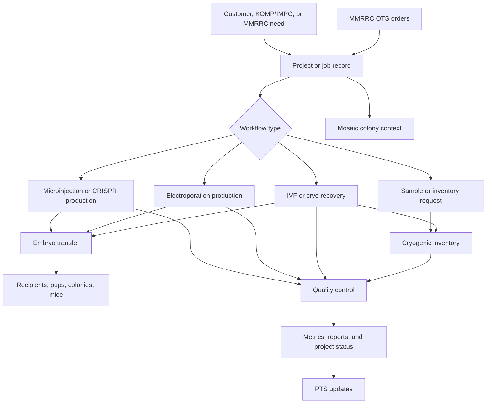
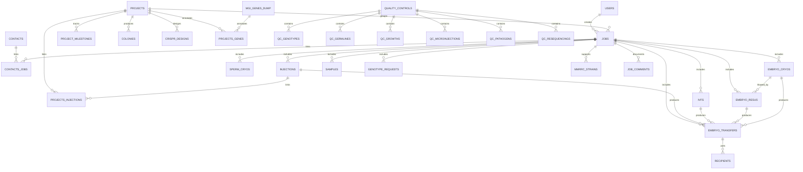
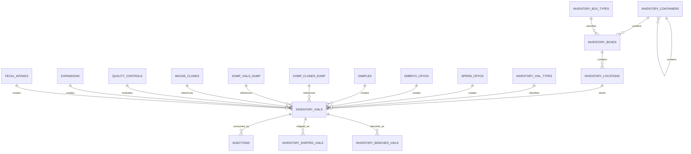
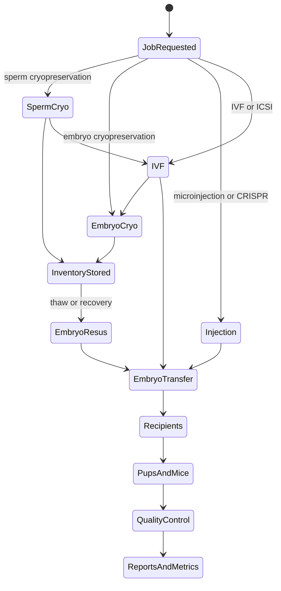

# Repro-LIMS (RT-LIMS)

Repro-LIMS is the laboratory information management system used by the Mouse Biology Program to coordinate high-throughput mouse engineering and reproductive technology operations. The application is named Repro-LIMS for users and review materials, but is still referred to internally and in parts of the codebase as RT-LIMS.

The system supports the logistics, records, and production metrics around designing, creating, expanding, cryopreserving, recovering, and delivering engineered mouse models. It has been in continuous production use since the last major modernization in 2018, with subsequent updates made as laboratory processes, reporting needs, and procedure types changed.

## Primary Users

The main user groups are:

- Mouse Biology Program Laboratory Operations technicians
- Customer service staff
- Administrative and operational leadership
- Technical staff responsible for application support, data integrations, and reporting

## Scientific and Operational Scope

Repro-LIMS coordinates work and creates its own operational records and metrics for mouse engineering and reproductive technology activities. It is not only a mirror of external systems; it is a working system of record for many local laboratory activities.

Major supported areas include:

- Animal and vivarium requests
- Mouse engineering project tracking
- Microinjection jobs
- CRISPR design and production workflows
- Electroporation jobs
- IVF operations
- Embryo and sperm cryopreservation
- Cryogenic sample management
- Gamete expansion workflows
- Inventory and sample logistics
- Breeding calendars
- Superovulation calendars
- Quality control and production metrics

## Critical Workflows

The most critical workflows are:

- Fulfillment of MMRRC orders using cryogenic stocks and local expansion workflows
- High-throughput production of knockout mice for KOMP/IMPC efforts
- Academic requests for engineered mice
- Tracking project status, laboratory work, sample movement, and production outcomes
- Reporting selected project data back to the Mouse Biology Program Project Tracking System

These workflows rely on coordination between customer service, laboratory operations, cryogenic inventory, production scheduling, and external colony/order/project systems.

## External Integrations

Current active integrations include:

- MMRRC Order Tracking System (OTS), used to consume catalog orders that require local recovery or expansion from cryogenic stocks
- Mosaic colony breeding management system, used for colony and animal-related operational data
- Mouse Biology Program Project Tracking System (PTS), which receives selected project updates from Repro-LIMS

Historical or legacy references may still exist in the codebase for iMits/IMPC/KOMP reporting. KOMP/IMPC production remains an important scientific workflow, but the currently active external integrations are MMRRC OTS, Mosaic, and PTS updates.

## Scheduled Jobs and Related Systems

Some scheduled processing is handled outside this repository by the business logic server API-NS. Those jobs are part of the broader Repro-LIMS operating environment but are not fully documented in this repository.

This repository does include `mosaic_cron.php`, which is related to Mosaic integration behavior.

## Data Profile

The application primarily contains operational and scientific production data rather than clinical or patient data. Data includes project records, job records, mouse engineering workflow data, inventory data, cryogenic sample records, order fulfillment information, production outcomes, and operational metrics.

## Environments

The application is operated in three main instances:

- Development
- Test
- Production

Deployment is currently managed through GitLab CI. See `.gitlab-ci.yml` for staging and production deployment behavior.

## Technology Overview

Repro-LIMS is a CakePHP 3 application.

Core technology:

- PHP 7.2 or newer, as declared by `composer.json`
- CakePHP 3.6
- MySQL database
- Composer-managed PHP dependencies
- GitLab CI for linting and deployment
- CAS authentication support through `snelg/cakephp-3-cas`

The database follows CakePHP 3 conventions for tables, models, and associations. Application table classes are located under `src/Model/Table`, and controller classes are located under `src/Controller`.

## Code Map

Useful entry points for developers:

- `src/Controller/ProjectsController.php` and `src/Model/Table/ProjectsTable.php`: project tracking
- `src/Controller/JobsController.php` and `src/Model/Table/JobsTable.php`: laboratory jobs and operational work tracking
- `src/Controller/InjectionsController.php`: microinjection workflows
- `src/Controller/CrisprDesignsController.php`: CRISPR design workflows
- `src/Controller/ElectroporationsController.php`: electroporation workflows
- `src/Controller/IvfsController.php`: IVF workflows
- `src/Controller/SpermCryosController.php` and `src/Controller/EmbryoCryosController.php`: cryopreservation workflows
- `src/Controller/Inventory*Controller.php`: cryogenic and sample inventory logistics
- `src/Controller/MmrrcStrainsController.php`: MMRRC-related strain support
- `src/Controller/MosaicController.php` and `mosaic_cron.php`: Mosaic integration behavior
- `src/Controller/ReportsController.php`: reporting views and outputs
- `src/Controller/QualityControlsController.php` and `src/Controller/Qc*Controller.php`: quality control workflows

## Primary Workflow



## Core Data Model

This is a logical schema summary derived from the CakePHP table classes under `src/Model/Table`. It is intended to help reviewers understand the application data model and major relationships. It is not a generated MySQL DDL export.

### High-Level Entity Relationships



### Cryogenic Inventory Relationships



### Reproductive Technology Flow



### Main Tables

| Table | Role | Key relationships / fields used by code |
| --- | --- | --- |
| `projects` | Mouse engineering project record. Tracks project type, status, mutation, phenotype, associated genes, colonies, CRISPR designs, injections, and jobs. | Belongs to `project_types`, `project_statuses`, `mutations`, `phenotypes`; many-to-many with `mgi_genes_dump` through `projects_genes`; many-to-many with `injections` through `projects_injections`; has many `jobs`, `colonies`, `crispr_designs`, and `project_milestones`. |
| `jobs` | Central work coordination record for laboratory service requests and production work. | Belongs to `users`, `projects`, `job_astatuses`, `job_bstatuses`, and `mgi_genes_dump`; has many `injections`, `ivfs`, `sperm_cryos`, `embryo_cryos`, `embryo_resus`, `embryo_transfers`, `samples`, `genotype_requests`, `job_comments`, and `job_types`; links to `contacts` through `contacts_jobs`; links to KOMP vial data through `kompvials_jobs`. |
| `contacts` / `contacts_jobs` | Customer, investigator, and job contact linkage. | `jobs` belongs to many `contacts`; `contacts_jobs` stores the job/contact join records. |
| `crispr_designs` | CRISPR design records for a project. | Belongs to `projects` and `users`; has many `crispr_attributes`. |
| `crispr_attributes` | Attribute rows attached to CRISPR designs. | Belongs to `crispr_designs`; stores design-specific details. |
| `injections` | Microinjection and CRISPR injection production record. | Belongs to `jobs`, `users`, and optionally `inventory_vials`; many-to-many with `projects` through `projects_injections`; has many `embryo_transfers`, `colonies`, and `haploinsufficiencies`; has one `qc_microinjections`. Includes production counts and iMits/API-NS update flags. |
| `electroporations` | Electroporation run record. | Belongs to `users`; has many `electroporations_kompday_labels`; stores condition/device/zygote recovery fields. |
| `kompdays` / `kompday_labels` | KOMP day and label workflow records used with electroporation labels and signoffs. | `kompday_labels` belongs to `kompdays`, `projects`, `users`, and signoff rows; links to `electroporations` through `electroporations_kompday_labels`. |
| `ivfs` | IVF/ICSI workflow record. | Belongs to `jobs`, `sperm_cryos`, and `users`; has many `embryo_cryos`, `ivf_dishes`, and `embryo_transfers`. |
| `sperm_cryos` | Sperm cryopreservation record. | Belongs to `jobs` and `users`; has many `inventory_vials` and `ivfs`. Stores donor, cryo, motility, genotype, and post-thaw fields. |
| `embryo_cryos` | Embryo cryopreservation record. | Belongs to `jobs`, `ivfs`, and `users`; has many `embryo_resus`, `embryo_transfers`, and `inventory_vials`. |
| `embryo_resus` | Embryo resuscitation/thaw recovery record. | Belongs to `jobs` and `embryo_cryos`; has many `embryo_transfers` and `mmrrc_strains`. |
| `embryo_transfers` | Embryo transfer event and outcome record. | Belongs to `jobs`, `injections`, `ivfs`, `embryo_cryos`, `embryo_resus`, and `users`; has many `recipients`. Stores transfer counts, expected DOB, pup outcomes, litter rates, mutant counts, and chimera-related counts. |
| `recipients` | Recipient animal rows for embryo transfer. | Belongs to `embryo_transfers` and `users`. Recipient saves/deletes update transfer totals back to linked injections. |
| `samples` | Sample record associated with a job. | Belongs to `jobs` and `users`; has many `inventory_vials`, `inventory_shipped_vials`, and `files`. Stores sample type, strain, PTS ID, order number, and notes. |
| `genotype_requests` / `genotypings` | Genotyping request and result/support records. | `genotype_requests` belongs to `jobs` and `users`; has many `genotypings`. `genotypings` links to inventory locations and stores genotyping workflow data. |
| `mmrrc_strains` | MMRRC strain/order-support record. | Belongs to `jobs`, `embryo_resus`, and `users`; links to `contacts` through `mmrrc_strains_contacts`. Stores stock number, strain information, shipping/arrival information, release status, and comments. |
| `inventory_containers` | Hierarchical inventory container structure. | Self-referential parent/child relationship; has many `inventory_boxes`. |
| `inventory_boxes` | Physical box inside a container. | Belongs to `inventory_containers` and `inventory_box_types`; has many `inventory_locations`. |
| `inventory_locations` | Physical cell/location inside an inventory box. | Belongs to `inventory_boxes`; has one `inventory_vials` or `inventory_benched_vials`; has many `genotypings`. |
| `inventory_vials` | Central cryogenic inventory vial record. | Belongs to `sperm_cryos`, `embryo_cryos`, `samples`, `inventory_vial_types`, `inventory_locations`, `komp_clones_dump`, `komp_vials_dump`, `mouse_clones`, `quality_controls`, `expansions`, and `fecal_intakes`; has many `injections`. |
| `inventory_benched_vials` / `inventory_shipped_vials` | Inventory movement/state records for vials removed from storage or shipped. | Link to samples, quality controls, expansions, and inventory locations depending on workflow. |
| `quality_controls` | Parent quality-control record. | Belongs to `users` and `mouse_clones`; has many QC subtype rows and inventory movement rows. |
| `qc_*` tables | Specific QC test/result tables. | Include genotype, germline, growth, karyotype, microinjection, pathogen, resequencing, TMK, creflip, chimera mouse, and customer in vivo QC workflows. |
| `expansions` / `passages` | Cell/gamete expansion tracking. | `expansions` belongs to `users`, `mouse_clones`, and shipped vial parents; has many `passages`; can create inventory vial records and QC growth records. |
| `mice` / `litter` | Mouse and litter records used for production outcomes. | `mice` belongs to shipped vials and microinjection QC; has many Mosaic mouse links and litter rows. |
| `mgi_genes_dump`, `komp_*_dump`, `imits_dump_*` | Imported or mirrored reference/reporting data. | Used for gene metadata, KOMP project/clone/vial context, and historical iMits/IMPC-related reporting. |

### External Data and Reporting Touchpoints

| System | Direction | Local tables / modules | Notes |
| --- | --- | --- | --- |
| Mosaic | Read/sync through application/API-NS behavior | `MosaicController`, `mosaic_cron.php`, `mice`, `colonies`, workflow controllers | Used for colony and animal context around production workflows. |
| MMRRC OTS | Input | `mmrrc_strains`, `jobs`, `samples`, cryo/inventory workflow tables | Orders are represented locally so cryogenic recovery or expansion work can be coordinated and fulfilled. |
| Mouse Biology Program PTS | Output | `projects`, `jobs`, `samples`, workflow status fields | Selected project/job/sample updates are reported back to PTS. |
| API-NS business logic server | Background processing | Flags such as `injections.do_imits_update`; scheduled jobs outside this repository | Some scheduled integration work lives outside this codebase and is part of the broader deployment environment. |
| KOMP/IMPC/iMits historical data | Reference/reporting | `komp_*_dump`, `imits_dump_*`, project/injection fields | KOMP/IMPC production remains a critical workflow; some iMits behavior is legacy or delegated outside this repository. |

## Installation

When pulling the repository for local development, install Composer dependencies:

```sh
curl -s https://getcomposer.org/installer | php
php composer.phar update
```

Application configuration is expected to be environment-specific. Start from `config/.env.default` where appropriate and configure local database, authentication, and integration settings for the target environment.

## Testing and Linting

Composer defines the following scripts:

```sh
php composer.phar test
php composer.phar cs-check
php composer.phar check
```

GitLab CI also performs PHP syntax linting on PHP and Cake template files outside `vendor` and `tests`.

## Deployment

See `.gitlab-ci.yml` for deployment details.

Current deployment behavior includes:

- Staging deployment from the `staging` branch to `staging-rt-lims.mousebiology.org`
- Production deployment from the `master` branch to `rt-lims.mousebiology.org`
- Production deployment guard that checks whether `master` contains commits not present on `staging`
- Production cache clearing through `bin/clear-cache.sh`

## External Interaction References

- [Mosaic](https://online.mosaicvivarium.com/efeb6b5010934652aa65f2a6dec950/Vivarium/Admin/ApplicationProgrammingInterface.aspx)
- [iMits](https://github.com/mpi2/imits/wiki) (deprecated)

## Plugins and Notable Dependencies

- [snelg/cakephp-3-cas](https://packagist.org/packages/snelg/cakephp-3-cas)
- CakePHP 3.6
- cakephp/migrations
- friendsofcake/bootstrap-ui
- josegonzalez/dotenv
- phpoffice/phpexcel

## Legacy Notes and Known Issues

This is an older production application with long-running operational importance. The codebase contains legacy naming, dependencies, and conventions from earlier phases of development.

Known notes from previous README versions:

- You cannot sort the index datatables on fields that are from a join to another table. If there is a need to sort on one of these fields, create a database view.
- The installed version `1.81` of `src/Utility/fpdf.php` and the associated `makefont.php` file are older versions with code that is not compatible with PHP 7.0.
